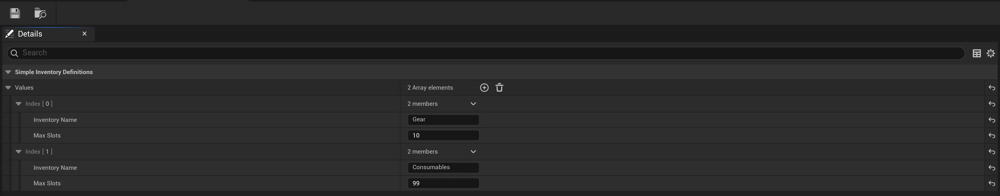

# SimpleInventory

[](https://ko-fi.com/minigamedev)
[](https://bsky.app/profile/minigamedev.bsky.social)
[](https://mastodon.gamedev.place/@minigamedev)


**SimpleInventory** is a lightweight and flexible inventory system for Unreal Engine 5+, designed to be simple enough for small projects yet extensible enough to grow with your game.  
It uses `InstancedStruct` for item definitions, supports stacking, change events, persistence, and integrates with Blueprints and C++.

**Example Project**: https://github.com/Ericdowney/SimpleInventoryExample/


## ✨ Features

- **Item Management**
  - Add, remove, copy, and clear items.
  - Stackable or non-stackable items with customizable stack sizes.
  - Automatic slot resizing and enforcement of maximum slot counts.

- **Events & Notifications**
  - Inventory change events (`Addition`, `Removal`, `Clear`, `Copy`, `Full`, etc.).
  - Broadcast events for UI updates or gameplay reactions.

- **Blueprint & C++ Support**
  - Fully exposed to Blueprints for rapid prototyping.
  - Clean C++ API for performance-critical systems.

- **Subsystem Integration**
  - `USimpleInventorySubsystem` for global inventory management across your game.
  - Register inventories by name or via a `DataAsset` (`USimpleInventoryDefinitions`).

- **Actor Integration**
  - `USimpleInventoryComponent` for adding an inventory to any `AActor`.

- **Save & Load Support**
  - Inventory data can be stored in a `FSimpleInventorySubsystemStorage` struct for use with `USaveGame`.

- **Detailed Logging**
  - Debug inventory behavior with `SimpleInventoryLog`.

## 📦 Installation

* Copy the SimpleInventory plugin folder into your Unreal Engine project's Plugins directory.
* Enable the plugin in Edit → Plugins.
* Restart the editor.

## ⚙️ Setup

### 1. Define Your Item Struct

The plugin provides a base struct:

```c++
USTRUCT(BlueprintType, Blueprintable)
struct SIMPLEINVENTORY_API FSimpleInventoryItem
{
    GENERATED_BODY()

    UPROPERTY(BlueprintReadWrite, EditAnywhere)
    int32 ID;

    UPROPERTY(BlueprintReadWrite, EditAnywhere)
    bool bIsStackable;

    UPROPERTY(BlueprintReadWrite, EditAnywhere)
    int32 StackSize;

    UPROPERTY(BlueprintReadWrite, EditAnywhere)
    FText ItemName;
};
```

You must subclass this in C++ to add your own game-specific item properties:

```c++
USTRUCT(BlueprintType)
struct FMyGameItem : public FSimpleInventoryItem
{
    GENERATED_BODY()

    UPROPERTY(BlueprintReadWrite, EditAnywhere)
    TObjectPtr<UTexture2D> Icon;

    // Other properties...
};
```

**Note**: Due to Unreal Engine’s Blueprint struct behavior, you must create your struct in C++. Blueprint-created structs will not work because property names cannot be guaranteed.

### 2. Create a Data Table

Once you have your custom struct, you can create a Data Table in the editor to hold your item definitions. I recommend creating a separate data table for each item type in your game. i.e. Gear, weapons, currency, etc.

* In the Content Browser: Right Click → Miscellaneous → Data Table.
* Select your custom struct (i.e., FMyGameItem).
* Fill in rows with item data.

### 3. Accessing the Subsystem

In C++:

```c++
USimpleInventorySubsystem* InventorySubsystem = GetGameInstance()->GetSubsystem<USimpleInventorySubsystem>();
```

In Blueprints:
* Search for Get SimpleInventorySubsystem node.

### 4. Registering an Inventory

Inventories can be registered in two ways:

1. Direct Registration – Call RegisterInventory (available in both C++ and Blueprints).

This function takes:

* FName InventoryName – A unique name for the inventory.
* int32 MaxSlots – The maximum number of slots the inventory can hold.
* USimpleInventory*& – An output pointer to the newly created (or existing) inventory.

2. Data Asset Registration – Create a SimpleInventoryDefinitions Data Asset (see screenshot below) to define multiple inventories at once. Pass this asset to RegisterInventoryDefinitions to register all defined inventories in bulk.




```c++
USimpleInventory* MyInventory;
InventorySubsystem->RegisterInventory("PlayerInventory", 30, MyInventory);
```

### 5. Adding Items

Items must be wrapped in an `FInstancedStruct`:

```c++
FMyGameItem ActualItem;
// Fill ActualItem data...

InventorySubsystem->AddItem("PlayerInventory", FInstancedStruct::Make(ActualItem), 5, bResult);
```

**Note**: To avoid using `FInstancedStruct` everywhere, I recommend creating your own facade (Blueprint Library or custom subsystem) that wraps `SimpleInventorySubsystem` calls and works directly with your game’s item type(s).

### 6. Saving & Loading

Inventories can be serialized and restored via storage structs:

```c++
FSimpleInventorySubsystemStorage Storage;
Subsystem->GetStorage(Storage);

// Later...
Subsystem->InflateFromStorage(Storage);
```

## 📢 Events

Both `USimpleInventory` and `USimpleInventorySubsystem` broadcast change events when an inventory updates:

* Addition
* Removal
* Multi Removal
* Clear
* Copy
* Force
* Full (inventory is full)

You can bind to:

```c++
InventorySubsystem->OnInventorySubsystemChangeEvent.AddDynamic(this, &ThisClass::OnInventoryChanged);
```

## 🛠 Logging

To enable detailed logging, Add this to your `DefaultEngine.ini`:

```ini
[Core.Log]
SimpleInventoryLog=Verbose
```

## 🤝 Contributing

Feel free to fork, extend, and integrate it into your own systems. If you improve it, consider sharing back via a pull request or issue!

## 📄 License

This plugin is released under the MIT License. Feel free to use and modify it in your projects.

